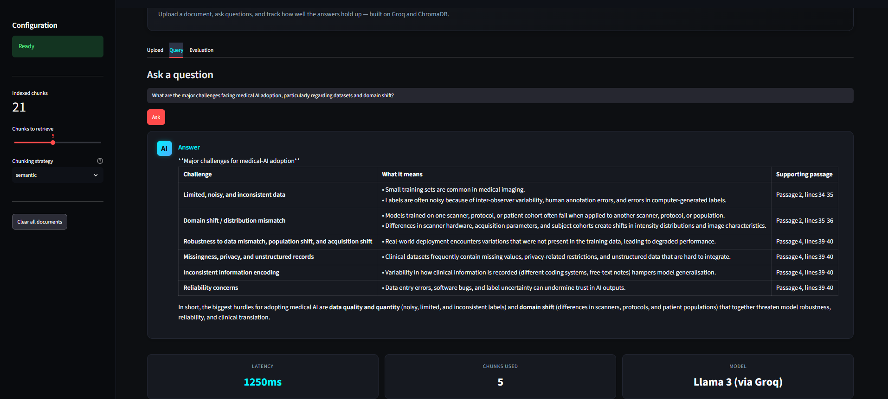
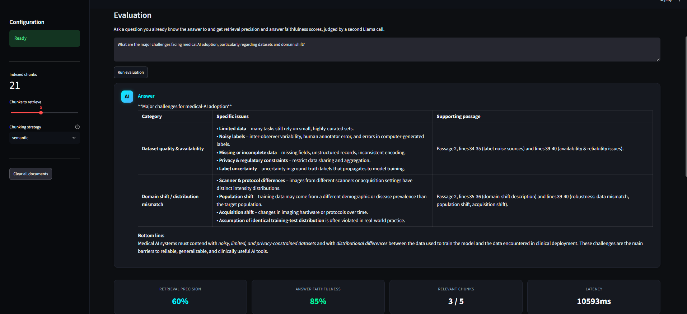

# Intelligent Document QA


A Streamlit dashboard for asking natural-language questions over your own documents, with retrieval quality evaluation built in. Upload a PDF or text file, ask a question and see which passages were used to answer it, along with retrieval precision and answer faithfulness scores.

## Why this exists

Most RAG demos stop at "ask a question about one PDF." That tells you nothing about whether your chunking strategy is actually working, or whether retrieval is pulling the right context before the model even sees it. This project treats evaluation as a first-class feature rather than an afterthought: swap chunking strategies, score retrieval precision and answer faithfulness per query, and track those metrics over time from the same UI.

## Features

- **Document ingestion** — PDF, `.txt` and `.md` uploads, chunked and embedded automatically
- **Two chunking strategies** — fixed-size token windows or sentence-aware semantic splitting
- **Question answering** — retrieval over ChromaDB, answers generated by Claude with cited source passages
- **Evaluation mode** — LLM-as-judge scoring for retrieval precision and answer faithfulness on any question
- **Run history** — evaluation results are logged locally and can be exported to CSV
- **Sample document** — a short RAG explainer bundled in, for trying the app without your own files

## Screenshots

**Query — ask a question and get cited answers:**



**Evaluation — score retrieval precision and answer faithfulness:**



## Installation

```bash
git clone https://github.com/Saravanan-vasudevan/Rag-Evaluation-Engine
cd intelligent-document-qa
pip install -r requirements.txt
```

Copy the secrets template and add your Anthropic API key:

```bash
cp .streamlit/secrets.toml.example .streamlit/secrets.toml
```

Then edit `.streamlit/secrets.toml` and set `ANTHROPIC_API_KEY`. Get a key from [console.anthropic.com](https://console.anthropic.com).

If you'd rather not use a secrets file, the app also accepts the key through a sidebar field at runtime.

## Usage

```bash
streamlit run app.py
```

Open the URL Streamlit prints (usually `http://localhost:8501`), then:

1. **Upload tab** — drop in a PDF/text file, or click "Load sample document" to try it without your own files
2. **Query tab** — ask a question and see the answer with cited source passages
3. **Evaluation tab** — ask a question you already know the answer to and get precision/faithfulness scores, with history tracked over time

## Project structure

```
intelligent-document-qa/
├── app.py                      # Streamlit entry point, wires everything together
├── src/rag_engine/
│   ├── config.py                # constants, model IDs, system prompt
│   ├── embeddings.py            # sentence-transformers wrapper
│   ├── chunking.py              # fixed-size and semantic chunking
│   ├── loaders.py                # PDF / text file readers
│   ├── vectorstore.py           # ChromaDB collection, ingestion, retrieval
│   ├── qa.py                     # Groq call + answer assembly
│   └── evaluation.py            # precision / faithfulness scoring, run log
├── ui/
│   ├── styles.py                 # dashboard CSS
│   └── components.py            # shared HTML render helpers
├── data/sample_docs/            # bundled sample document
├── tests/                        # pytest suite
└── requirements.txt
```

## Tech stack

| Layer | Tool |
|---|---|
| LLM | Anthropic Claude (claude-sonnet-4-6 for answers, claude-haiku-4-5 for eval scoring) |
| Vector store | ChromaDB (local, persistent) |
| Embeddings | sentence-transformers (all-MiniLM-L6-v2) |
| Dashboard | Streamlit |
| Testing | pytest |

## Notes

- ChromaDB persists locally under `/tmp/chroma_store` by default (configurable via the `CHROMA_DIR` environment variable). No external database required.
- `all-MiniLM-L6-v2` is used for embeddings because it runs comfortably on CPU. Swapping to a larger model is a one-line change in `src/rag_engine/config.py`.
- Evaluation scoring makes a second Claude call per run to judge faithfulness and precision, so eval runs cost a small number of extra API tokens.

## License

MIT — see [LICENSE](LICENSE).
